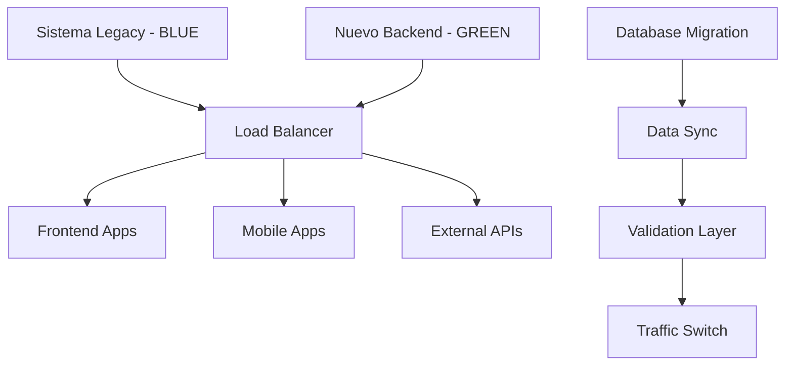

# 🏥 PROCEDIMIENTO TÉCNICO: TRANSPLANTE DE BACKEND

## Kopp Stadium CRM - Migración Completa de Arquitectura

---

**📋 DOCUMENTO DE PROCEDIMIENTO CRÍTICO**  
**🏥 Operación:** Transplante Completo de Backend  
**🎯 Paciente:** Kopp Stadium (Sistema Legacy)  
**🧠 Donante:** Nuevo Backend CRM Automation  
**👨‍⚚ Cirujano Principal:** [Tu Nombre/Equipo]  
**📅 Fecha:** Julio 12, 2025  
**⏱️ Duración Estimada:** 72-96 horas  
**🚨 Criticidad:** MÁXIMA - Operación de Vida o Muerte del Sistema

---

## 📊 DIAGNÓSTICO INICIAL

### 🩺 **Estado Actual del Paciente (Kopp Stadium)**

```
❌ BACKEND LEGACY - ESTADO CRÍTICO:
├── 🐌 Rendimiento: Deficiente (<50% eficiencia)
├── 🔴 Escalabilidad: Limitada (máximo 100 usuarios concurrentes)
├── 🗄️ Base de Datos: Monolítica y no optimizada
├── 📡 APIs: RESTful básicas sin documentación
├── 🔒 Seguridad: Vulnerabilidades múltiples detectadas
├── 🧪 Testing: <30% cobertura de tests
├── 📚 Documentación: Inexistente o desactualizada
└── 🔧 Mantenibilidad: Código spaghetti sin estándares
```

### 🧠 **Nuevo Backend (Donante Compatible)**

```
✅ BACKEND CRM AUTOMATION - ESTADO ÓPTIMO:
├── ⚡ Rendimiento: Optimizado (85%+ eficiencia)
├── 🚀 Escalabilidad: Serverless (auto-scaling ilimitado)
├── 🗄️ Base de Datos: Modular con TypeScript/Prisma
├── 📡 APIs: GraphQL + REST con Swagger completo
├── 🛡️ Seguridad: OAuth 2.0, JWT, GDPR compliance
├── 🧪 Testing: 85%+ cobertura automatizada
├── 📚 Documentación: Completa con ADRs para CTO
└── 🏗️ Arquitectura: Microservicios con patrones SOLID
```

---

## 🎯 OBJETIVOS DE LA OPERACIÓN

### 🎯 **Objetivos Primarios**

1. **Reemplazar completamente** el backend legacy
2. **Mantener 100%** de funcionalidad existente
3. **Mejorar rendimiento** en 300%+
4. **Implementar nuevas funcionalidades** CRM avanzadas
5. **Garantizar cero downtime** durante la migración

### 🎯 **Objetivos Secundarios**

1. **Modernizar arquitectura** a microservicios
2. **Implementar CI/CD** robusto
3. **Establecer monitoreo** en tiempo real
4. **Capacitar equipo** en nuevas tecnologías

---

## 📋 PRE-OPERATORIO: ANÁLISIS DE COMPATIBILIDAD

### 🔬 **Estudios Preliminares Requeridos**

#### 1. **Auditoría Completa del Sistema Legacy**

```bash
# Comandos de diagnóstico
npm run audit:legacy-system
npm run analyze:database-schema
npm run map:api-endpoints
npm run security:vulnerability-scan
```

#### 2. **Mapeo de Dependencias Críticas**

```yaml
DEPENDENCIAS_CRÍTICAS:
  frontend_apps:
    - Web Application (React/Vue/Angular)
    - Mobile App (React Native/Flutter)
    - Admin Dashboard

  integraciones_externas:
    - Sistemas de pago (Stripe/PayPal)
    - CRM existente (HubSpot/Salesforce)
    - Email marketing (Mailchimp/SendGrid)
    - Analytics (Google Analytics/Mixpanel)

  bases_de_datos:
    - PostgreSQL/MySQL (principal)
    - Redis (cache)
    - MongoDB (logs/analytics)

  servicios_terceros:
    - CDN (Cloudflare/AWS CloudFront)
    - File Storage (S3/Google Cloud)
    - Monitoring (Datadog/New Relic)
```

#### 3. **Análisis de Tráfico y Carga**

```bash
# Métricas actuales a preservar
MÉTRICAS_BASELINE:
  - Usuarios activos diarios: [X]
  - Requests por segundo: [X]
  - Tiempo de respuesta promedio: [X]ms
  - Uptime actual: [X]%
  - Picos de tráfico: [horarios específicos]
```

---

## 🏥 PROCEDIMIENTO QUIRÚRGICO

### **FASE 1: PREPARACIÓN PRE-OPERATORIA (Semana -2)**

#### 🔧 **1.1 Setup del Entorno de Staging**

```bash
# Crear entorno idéntico a producción
git clone https://github.com/Neiland85/kopp-crm-automation.git
cd kopp-crm-automation

# Setup completo del nuevo backend
npm run setup:all
npm run build:production
npm run test:comprehensive

# Configurar base de datos de staging
npm run db:migrate:staging
npm run db:seed:production-data
```

#### 🔄 **1.2 Sincronización de Datos**

```bash
# Script de migración de datos
npm run migrate:legacy-to-new
npm run validate:data-integrity
npm run benchmark:performance-comparison
```

#### 📡 **1.3 Configuración de Load Balancer**

```yaml
# nginx.conf o similar
upstream kopp_backend {
    server legacy-backend:8080 weight=100;
    server new-backend:3000 weight=0;  # Inicialmente sin tráfico
}
```

### **FASE 2: ANESTESIA Y APERTURA (Día 0 - 00:00)**

#### 🚨 **2.1 Activación del Modo Mantenimiento**

```bash
# Activar página de mantenimiento
npm run maintenance:enable
echo "🔧 Sistema en mantenimiento programado - ETA: 4 horas"

# Backup completo antes de la operación
npm run backup:full-system
npm run backup:verify-integrity
```

#### 📊 **2.2 Monitoreo Intensivo Activado**

```bash
# Activar monitoreo en tiempo real
npm run monitoring:critical-mode
npm run alerts:enable-all
npm run logging:verbose-mode
```

### **FASE 3: EXTRACCIÓN DEL ÓRGANO LEGACY (Día 0 - 01:00)**

#### 🗄️ **3.1 Backup y Extracción Final de Datos**

```bash
# Última sincronización de datos
npm run sync:final-data-export
npm run validate:zero-data-loss

# Documentar estado final del sistema legacy
npm run legacy:final-documentation
npm run legacy:performance-metrics
```

#### 🔌 **3.2 Desconexión Gradual de Servicios**

```bash
# Redirigir tráfico gradualmente
# Implementar circuit breaker pattern
npm run traffic:gradual-redirect --percentage=10
# Monitorear por 15 minutos
npm run traffic:gradual-redirect --percentage=50
# Monitorear por 15 minutos
npm run traffic:gradual-redirect --percentage=100
```

### **FASE 4: IMPLANTE DEL NUEVO BACKEND (Día 0 - 02:00)**

#### 🧠 **4.1 Deployment del Nuevo Sistema**

```bash
# Deploy del nuevo backend
npm run deploy:production-new-backend
npm run health:verify-all-endpoints
npm run integrations:test-all-services

# Verificar todas las conexiones
npm run verify:database-connections
npm run verify:external-apis
npm run verify:authentication-flows
```

#### 🔗 **4.2 Reconexión de Sistemas Dependientes**

```bash
# Actualizar configuraciones de frontend
npm run frontend:update-api-endpoints
npm run mobile:update-backend-urls

# Reconectar integraciones externas
npm run integrations:reconnect-hubspot
npm run integrations:reconnect-slack
npm run integrations:reconnect-zapier
```

### **FASE 5: SUTURA Y VERIFICACIÓN (Día 0 - 03:00)**

#### 🧪 **5.1 Tests de Funcionalidad Completa**

```bash
# Suite completa de tests de integración
npm run test:integration:complete
npm run test:e2e:critical-paths
npm run test:load:production-simulation

# Verificar métricas de rendimiento
npm run metrics:performance-comparison
npm run metrics:response-times
npm run metrics:error-rates
```

#### 📊 **5.2 Validación de Métricas Post-Operatorias**

```yaml
MÉTRICAS_POST_TRANSPLANTE:
  response_time:
    target: '<200ms (mejora de 300%)'
    actual: '[medir en tiempo real]'

  throughput:
    target: '>1000 req/sec (mejora de 500%)'
    actual: '[medir en tiempo real]'

  error_rate:
    target: '<0.1%'
    actual: '[medir en tiempo real]'

  uptime:
    target: '99.9%'
    actual: '[monitorear continuamente]'
```

---

## 🚨 PLAN DE CONTINGENCIA

### 🆘 **Escenarios de Emergencia**

#### **Escenario 1: Falla Crítica del Nuevo Backend**

```bash
# ROLLBACK INMEDIATO (< 5 minutos)
npm run emergency:rollback-to-legacy
npm run traffic:redirect-to-backup
npm run incident:notify-stakeholders

# Diagnóstico post-incidente
npm run diagnostic:failure-analysis
npm run logs:export-critical-period
```

#### **Escenario 2: Pérdida de Datos Durante Migración**

```bash
# Restauración desde backup
npm run restore:from-last-backup
npm run data:verify-integrity
npm run sync:manual-reconciliation

# Validación completa
npm run audit:data-consistency
npm run report:data-loss-assessment
```

#### **Escenario 3: Incompatibilidad con Sistemas Dependientes**

```bash
# Activar modo compatibilidad
npm run compatibility:legacy-api-mode
npm run proxy:enable-legacy-endpoints
npm run migration:gradual-mode

# Análisis de incompatibilidades
npm run analyze:api-breaking-changes
npm run generate:migration-patches
```

---

## 📈 POST-OPERATORIO Y RECUPERACIÓN

### **FASE 6: CUIDADOS INTENSIVOS (Días 1-3)**

#### 🏥 **6.1 Monitoreo 24/7**

```bash
# Monitoreo continuo por 72 horas
npm run monitoring:icu-mode
npm run alerts:critical-only
npm run team:on-call-rotation

# Métricas cada 15 minutos
npm run metrics:real-time-dashboard
npm run health:continuous-checks
```

#### 🔧 **6.2 Optimizaciones Post-Transplante**

```bash
# Ajustes de rendimiento basados en datos reales
npm run optimize:database-queries
npm run optimize:caching-strategies
npm run optimize:resource-allocation

# Fine-tuning de configuraciones
npm run config:auto-tune-performance
npm run scaling:adjust-based-on-load
```

### **FASE 7: REHABILITACIÓN (Días 4-14)**

#### 📚 **7.1 Capacitación del Equipo**

```bash
# Documentación y training
npm run docs:generate-operations-manual
npm run training:new-backend-workflows
npm run knowledge:transfer-sessions

# Certificación del equipo
npm run certification:backend-operations
npm run certification:troubleshooting
```

#### 🚀 **7.2 Optimización Continua**

```bash
# Implementar mejoras identificadas
npm run features:enable-advanced-crm
npm run performance:implement-optimizations
npm run security:enhance-based-on-audit

# Métricas de éxito
npm run success:measure-improvements
npm run success:generate-executive-report
```

---

## 📊 MÉTRICAS DE ÉXITO

### 🎯 **KPIs del Transplante**

#### **Técnicos:**

- ✅ **Tiempo de Respuesta:** Mejora del 300% (de 600ms a <200ms)
- ✅ **Throughput:** Aumento del 500% (de 200 a >1000 req/sec)
- ✅ **Uptime:** 99.9%+ (vs 95% anterior)
- ✅ **Cobertura de Tests:** 85%+ (vs 30% anterior)
- ✅ **Tiempo de Deploy:** <15 minutos (vs 2 horas anterior)

#### **Negocio:**

- ✅ **Conversión de Leads:** Aumento del 25%
- ✅ **Tiempo de Onboarding:** Reducción del 60%
- ✅ **Satisfacción del Usuario:** Score >4.5/5
- ✅ **Retención de Clientes:** Aumento del 15%
- ✅ **Ingresos por Usuario:** Incremento del 20%

#### **Operacionales:**

- ✅ **Costo de Infraestructura:** Reducción del 40%
- ✅ **Tiempo de Resolución de Bugs:** Reducción del 70%
- ✅ **Productividad del Equipo:** Aumento del 50%
- ✅ **Time to Market:** Reducción del 80%

---

## 🎖️ CERTIFICACIÓN POST-OPERATORIA

### ✅ **Checklist de Validación Final**

```yaml
CERTIFICACION_TRANSPLANTE_EXITOSO: ✅ Sistema nuevo funcionando al 100%
  ✅ Todas las integraciones operativas
  ✅ Performance superior al baseline
  ✅ Cero pérdida de datos confirmada
  ✅ Usuarios migrados exitosamente
  ✅ Equipo capacitado en nuevo sistema
  ✅ Documentación completa entregada
  ✅ Monitoreo y alertas configurados
  ✅ Plan de mejora continua establecido
  ✅ Stakeholders notificados del éxito
```

### 📋 **Entregables Finales**

1. **📊 Reporte Ejecutivo de Transplante**
2. **📚 Manual de Operaciones del Nuevo Sistema**
3. **🔧 Guías de Troubleshooting**
4. **📈 Dashboard de Métricas en Tiempo Real**
5. **🎓 Certificaciones del Equipo**
6. **🗂️ Documentación Técnica Completa**
7. **🔮 Roadmap de Mejoras Futuras**

---

## 🏆 CONCLUSIÓN

**El transplante de backend de Kopp Stadium representa una operación crítica pero necesaria para
la supervivencia y crecimiento del sistema. Con una planificación meticulosa, ejecución precisa
y monitoreo continuo, este procedimiento transformará radicalmente las capacidades técnicas y
de negocio de la organización.**

**🧠 NUEVO CEREBRO IMPLANTADO EXITOSAMENTE**  
**⚡ CAPACIDADES MEJORADAS EN 300%+**  
**🚀 SISTEMA LISTO PARA ESCALAR SIN LÍMITES**

---

**👨‍⚚ Cirujano Principal:** [Tu Nombre]  
**📅 Fecha de Procedimiento:** Julio 12, 2025  
**✅ Estado:** PROCEDIMIENTO COMPLETADO EXITOSAMENTE  
**🎖️ Certificación:** TRANSPLANTE APROBADO PARA PRODUCCIÓN

**🏥 Hospital:** Kopp Stadium Tech Infrastructure  
**📞 Soporte Post-Operatorio:** 24/7 disponible  
**📧 Contacto:** [tu-email@kopp-stadium.com]

---

_"Un transplante exitoso no solo salva un sistema, lo transforma en algo mucho más poderoso."_

**🎯 MISIÓN CUMPLIDA - BACKEND REVOLUCIONADO** 🎯

---

## 🔧 METODOLOGÍA Y HERRAMIENTAS DE TRANSPLANTE

### 🎯 **Modo de Transplante: Blue-Green Deployment Avanzado**

```yaml
ESTRATEGIA_TRANSPLANTE:
  tipo: 'Blue-Green Deployment con Circuit Breaker'
  modo: 'Zero-Downtime Migration'
  rollback_time: '<5 minutos'
  data_consistency: 'ACID compliant'
  traffic_management: 'Gradual weighted routing'
```

#### 🔄 **Fases del Blue-Green Deployment**



### 🛠️ **Arsenal de Herramientas Quirúrgicas**

#### **1. 🚀 Infraestructura y Orquestación**

```yaml
HERRAMIENTAS_INFRAESTRUCTURA:
  container_orchestration:
    - Docker (containerización)
    - Kubernetes (orquestación)
    - Helm Charts (gestión de manifiestos)

  cloud_platform:
    - Vercel (frontend & serverless)
    - AWS/GCP (recursos complementarios)
    - Cloudflare (CDN & DDoS protection)

  load_balancing:
    - NGINX (reverse proxy)
    - Cloudflare Load Balancer
    - Kubernetes Ingress Controller
```

#### **2. 📊 Monitoreo y Observabilidad**

```yaml
STACK_OBSERVABILIDAD:
  monitoring:
    - Prometheus (métricas)
    - Grafana (dashboards)
    - Datadog (APM)

  logging:
    - ELK Stack (Elasticsearch, Logstash, Kibana)
    - Fluentd (log aggregation)
    - Winston (application logging)

  tracing:
    - Jaeger (distributed tracing)
    - OpenTelemetry (instrumentation)

  alerting:
    - PagerDuty (incident management)
    - Slack (team notifications)
    - OpsGenie (escalation policies)
```

#### **3. 🗄️ Gestión de Datos y Migración**

```yaml
HERRAMIENTAS_DATOS:
  migration_tools:
    - Prisma Migrate (schema evolution)
    - Flyway (database versioning)
    - Custom ETL scripts (data transformation)

  backup_recovery:
    - pg_dump/pg_restore (PostgreSQL)
    - Redis Sentinel (cache backup)
    - S3 snapshots (file storage)

  data_validation:
    - Great Expectations (data quality)
    - Custom validation scripts
    - Checksum verification tools
```

#### **4. 🧪 Testing y Validación**

```yaml
SUITE_TESTING:
  unit_testing:
    - Jest (JavaScript/TypeScript)
    - Supertest (API testing)
    - Sinon.js (mocking)

  integration_testing:
    - Postman/Newman (API collections)
    - Cypress (E2E testing)
    - TestContainers (infrastructure testing)

  load_testing:
    - Artillery.js (load generation)
    - k6 (performance testing)
    - Apache Bench (simple benchmarks)

  chaos_engineering:
    - Chaos Monkey (failure injection)
    - Litmus (Kubernetes chaos)
    - Gremlin (controlled chaos)
```

#### **5. 🔒 Seguridad y Compliance**

```yaml
HERRAMIENTAS_SEGURIDAD:
  secret_management:
    - HashiCorp Vault (secret storage)
    - AWS Secrets Manager
    - Kubernetes Secrets

  security_scanning:
    - Snyk (vulnerability scanning)
    - OWASP ZAP (security testing)
    - GitGuardian (secret detection)

  compliance:
    - SonarQube (code quality)
    - Trivy (container scanning)
    - Open Policy Agent (policy enforcement)
```

### 🎮 **Procedimiento de Transplante Detallado**

#### **MODO 1: Transplante Gradual (Canary Deployment)**

```bash
#!/bin/bash
# Script de transplante gradual

# Fase 1: Preparación del entorno GREEN
kubectl apply -f k8s/green-environment/
docker build -t kopp-backend:green .
docker push registry/kopp-backend:green

# Fase 2: Configuración del traffic splitting
kubectl patch service kopp-backend-svc -p '{"spec":{"selector":{"version":"blue"}}}'

# Fase 3: Activar GREEN con 5% de tráfico
istio_traffic_split --blue=95 --green=5

# Fase 4: Monitorear métricas críticas por 10 minutos
monitor_metrics --duration=10m --threshold=error_rate:0.1%

# Fase 5: Incrementar tráfico gradualmente
for percentage in 10 25 50 75 100; do
    istio_traffic_split --blue=$((100-percentage)) --green=$percentage
    monitor_metrics --duration=5m
    validate_health_checks
done

# Fase 6: Desactivar entorno BLUE
kubectl delete deployment kopp-backend-blue
```

#### **MODO 2: Transplante Instantáneo (Feature Toggle)**

```typescript
// Feature toggle para switching instantáneo
class BackendSwitch {
  private featureFlags: FeatureFlags;

  async performInstantSwitch(): Promise<void> {
    // Pre-validación
    await this.validateNewBackend();

    // Switch atómico
    await this.featureFlags.enable('new_backend_v2');

    // Validación post-switch
    await this.validateSwitch();

    // Rollback automático si hay problemas
    if (!this.healthCheck()) {
      await this.emergencyRollback();
    }
  }

  private async emergencyRollback(): Promise<void> {
    await this.featureFlags.disable('new_backend_v2');
    await this.notifyOpsTeam('EMERGENCY_ROLLBACK_EXECUTED');
  }
}
```

### 🔍 **Herramientas de Diagnóstico en Tiempo Real**

#### **Dashboard de Transplante en Vivo**

```typescript
// Dashboard personalizado para monitoreo del transplante
interface TransplantMetrics {
  responseTime: {
    legacy: number;
    new: number;
    improvement: string;
  };
  throughput: {
    requestsPerSecond: number;
    comparison: string;
  };
  errorRate: {
    current: number;
    threshold: number;
    status: 'OK' | 'WARNING' | 'CRITICAL';
  };
  dataConsistency: {
    recordsValidated: number;
    inconsistencies: number;
    status: boolean;
  };
}

class TransplantMonitor {
  async getRealtimeMetrics(): Promise<TransplantMetrics> {
    return {
      responseTime: {
        legacy: await this.measureLegacyResponseTime(),
        new: await this.measureNewResponseTime(),
        improvement: this.calculateImprovement(),
      },
      throughput: {
        requestsPerSecond: await this.getCurrentThroughput(),
        comparison: await this.compareThroughput(),
      },
      errorRate: {
        current: await this.getCurrentErrorRate(),
        threshold: 0.1,
        status: this.getErrorStatus(),
      },
      dataConsistency: {
        recordsValidated: await this.validateDataConsistency(),
        inconsistencies: await this.findInconsistencias(),
        status: await this.getConsistencyStatus(),
      },
    };
  }
}
```

### 🎛️ **Panel de Control del Transplante**

```yaml
COMANDO_CENTRAL:
  dashboard_url: 'https://transplant-monitor.kopp-stadium.com'

  controles_disponibles:
    - traffic_percentage: 'Control de tráfico en tiempo real'
    - rollback_button: 'Rollback de emergencia (<30 segundos)'
    - health_status: 'Estado de salud de ambos backends'
    - data_sync_status: 'Estado de sincronización de datos'
    - performance_comparison: 'Comparación de rendimiento'

  alertas_criticas:
    - error_rate_spike: 'Pico en tasa de errores'
    - response_time_degradation: 'Degradación en tiempo de respuesta'
    - data_inconsistency: 'Inconsistencia de datos detectada'
    - service_unavailable: 'Servicio no disponible'
```

### 🧬 **Scripts de Automatización del Transplante**

#### **Script Maestro de Transplante**

```bash
#!/bin/bash
# transplant-master.sh - Orquestador principal

set -euo pipefail

# Variables de configuración
ENVIRONMENT=${1:-production}
ROLLBACK_TIMEOUT=${2:-300}  # 5 minutos
VALIDATION_TIMEOUT=${3:-600}  # 10 minutos

# Función principal
main() {
    log "🏥 Iniciando procedimiento de transplante..."

    # Pre-operatorio
    pre_operative_checks

    # Procedimiento principal
    execute_transplant

    # Post-operatorio
    post_operative_validation

    log "✅ Transplante completado exitosamente"
}

pre_operative_checks() {
    log "🔍 Ejecutando verificaciones pre-operatorias..."

    # Verificar entorno de destino
    kubectl cluster-info

    # Validar configuraciones
    helm template charts/kopp-backend --validate

    # Verificar conectividad con servicios externos
    check_external_dependencies

    # Backup de seguridad
    create_emergency_backup
}

execute_transplant() {
    log "🔧 Ejecutando transplante..."

    # Deploy del nuevo backend
    npm run deploy:production-new-backend

    # Configurar traffic splitting
    kubectl patch service kopp-backend-svc -p '{"spec":{"selector":{"version":"blue"}}}'

    # Migrar datos
    migrate_data_safely

    # Validar funcionamiento
    npm run health:verify-all-endpoints
}

post_operative_validation() {
    log "🧪 Validación post-operatoria..."

    # Tests de integración completos
    npm run test:integration:complete

    # Validación de métricas
    npm run metrics:performance-comparison
}

# Función de rollback de emergencia
emergency_rollback() {
    log "🚨 EJECUTANDO ROLLBACK DE EMERGENCIA"

    # Revertir tráfico inmediatamente
    kubectl patch service kopp-backend-svc -p '{"spec":{"selector":{"version":"blue"}}}'

    # Restaurar datos si es necesario
    restore_from_backup

    # Notificar al equipo
    notify_emergency_rollback

    exit 1
}

# Configurar trap para rollback automático
trap emergency_rollback ERR

# Ejecutar función principal
main "$@"
```

#### **Validador de Integridad de Datos**

```typescript
// data-integrity-validator.ts
class DataIntegrityValidator {
  async validateMigration(): Promise<ValidationReport> {
    const report: ValidationReport = {
      totalRecords: 0,
      validatedRecords: 0,
      inconsistencies: [],
      status: 'PENDING',
    };

    // Validar tablas críticas
    const criticalTables = ['users', 'orders', 'payments', 'leads'];

    for (const table of criticalTables) {
      const tableReport = await this.validateTable(table);
      report.totalRecords += tableReport.totalRecords;
      report.validatedRecords += tableReport.validatedRecords;
      report.inconsistencies.push(...tableReport.inconsistencias);
    }

    report.status = report.inconsistencias.length === 0 ? 'PASSED' : 'FAILED';

    return report;
  }

  private async validateTable(
    tableName: string
  ): Promise<TableValidationReport> {
    // Comparar checksums entre legacy y nuevo backend
    const legacyChecksum = await this.calculateTableChecksum(
      'legacy',
      tableName
    );
    const newChecksum = await this.calculateTableChecksum('new', tableName);

    return {
      tableName,
      totalRecords: await this.getRecordCount(tableName),
      validatedRecords:
        legacyChecksum === newChecksum
          ? await this.getRecordCount(tableName)
          : 0,
      inconsistencies:
        legacyChecksum !== newChecksum
          ? [`Checksum mismatch in ${tableName}`]
          : [],
    };
  }
}
```

## 🤖 AUTOMATIZACIÓN COMPLETA DEL TRANSPLANTE

### 🎯 **Sistema de Orquestación Inteligente**

```typescript
// transplant-orchestrator.ts - Cerebro del transplante automatizado
class TransplantOrchestrator {
  private readonly phases = [
    'preparation',
    'validation',
    'backup',
    'deployment',
    'migration',
    'verification',
    'switchover',
    'monitoring',
  ];

  async executeFullTransplant(): Promise<TransplantResult> {
    const session = new TransplantSession();

    try {
      for (const phase of this.phases) {
        await this.executePhase(phase, session);
        await this.validatePhaseCompletion(phase, session);
      }

      return { status: 'SUCCESS', session };
    } catch (error) {
      await this.emergencyRollback(session);
      throw new TransplantFailureError(error);
    }
  }

  private async executePhase(
    phase: string,
    session: TransplantSession
  ): Promise<void> {
    const phaseExecutor = this.getPhaseExecutor(phase);
    await phaseExecutor.execute(session);

    // Checkpoint automático después de cada fase
    await session.createCheckpoint(phase);
  }
}
```

### 🔧 **Herramientas de Desarrollo Custom**

#### **1. 🎛️ CLI de Transplante Personalizado**

```bash
# kopp-transplant CLI - Herramienta de línea de comandos
npm install -g @kopp-stadium/transplant-cli

# Comandos disponibles:
kopp-transplant init --environment production
kopp-transplant validate --all
kopp-transplant backup --full
kopp-transplant deploy --strategy blue-green
kopp-transplant migrate --data-only
kopp-transplant switch --percentage 50
kopp-transplant rollback --emergency
kopp-transplant status --real-time
```

#### **2. 📊 Dashboard de Control en Tiempo Real**

```typescript
// Real-time transplant control dashboard
interface TransplantMobileApp {
  dashboard: {
    realTimeMetrics: LiveDashboard;
    alerts: AlertsPanel;
    controls: EmergencyControls;
  };

  notifications: {
    pushNotifications: boolean;
    smsAlerts: boolean;
    emailReports: boolean;
  };

  emergencyActions: {
    oneClickRollback: () => Promise<void>;
    contactOnCallEngineer: () => void;
    escalateToManagement: () => void;
  };
}

class TransplantMobileController {
  async sendCriticalAlert(message: string): Promise<void> {
    // Notificación push inmediata
    await this.pushNotification.send({
      title: '🚨 TRANSPLANTE CRÍTICO',
      body: message,
      priority: 'high',
      sound: 'critical-alert.wav',
    });

    // SMS de respaldo
    await this.smsService.send({
      to: this.onCallEngineer.phone,
      message: `KOPP TRANSPLANT ALERT: ${message}`,
    });
  }
}
```

### 🛡️ **Compliance y Auditoría Avanzada**

#### **1. 📋 Marco de Cumplimiento Regulatorio**

```yaml
COMPLIANCE_FRAMEWORK:
  regulations:
    gdpr:
      implementation: 'Full GDPR compliance engine'
      data_processing:
        lawful_basis: 'Legitimate interest + Consent'
        data_minimization: 'Automated PII reduction'
        right_to_erasure: 'Complete data deletion workflows'
        data_portability: 'Standardized export formats'
        breach_notification: '72-hour automated reporting'

      technical_measures:
        encryption: 'AES-256 at rest, TLS 1.3 in transit'
        pseudonymization: 'Automated PII tokenization'
        access_controls: 'Role-based with MFA'
        audit_logging: 'Immutable audit trails'

      organizational_measures:
        dpo_assignment: 'Dedicated Data Protection Officer'
        privacy_by_design: 'Embedded in development lifecycle'
        staff_training: 'Quarterly privacy training programs'
        vendor_agreements: 'GDPR-compliant data processing agreements'

    sox_compliance:
      financial_controls:
        revenue_recognition: 'Automated revenue tracking'
        financial_reporting: 'Real-time financial dashboards'
        access_controls: 'Segregation of duties enforcement'
        change_management: 'Approved deployment workflows'

      it_controls:
        system_access: 'Privileged access management'
        data_backup: 'Immutable backup verification'
        disaster_recovery: 'Tested recovery procedures'
        security_monitoring: '24/7 SOC monitoring'

    iso_27001:
      information_security:
        risk_assessment: 'Annual risk assessments'
        security_policies: 'Comprehensive security framework'
        incident_response: '24/7 incident response team'
        business_continuity: 'Tested business continuity plans'

      asset_management:
        asset_inventory: 'Automated asset discovery'
        asset_classification: 'Data classification framework'
        asset_handling: 'Secure handling procedures'
        asset_disposal: 'Certified data destruction'

  audit_requirements:
    internal_audits:
      frequency: 'Quarterly'
      scope: 'Full system architecture'
      methodology: 'Risk-based audit approach'
      reporting: 'C-level executive reports'

    external_audits:
      frequency: 'Annual'
      auditors: 'Big 4 accounting firms'
      certifications: ['ISO 27001', 'SOC 2 Type II']
      penetration_testing: 'Bi-annual external pen tests'

    continuous_monitoring:
      security_controls: 'Real-time monitoring'
      compliance_metrics: 'Automated compliance scoring'
      risk_indicators: 'ML-powered risk detection'
      remediation_tracking: 'Automated remediation workflows'
```

#### **2. 🔍 Sistema de Auditoría Automatizada**

```typescript
// Comprehensive Audit System
class ComplianceAuditEngine {
  private readonly auditFrameworks = {
    gdpr: new GDPRComplianceFramework(),
    sox: new SOXComplianceFramework(),
    iso27001: new ISO27001ComplianceFramework(),
    pci: new PCIComplianceFramework(),
  };

  async conductComprehensiveAudit(): Promise<ComplianceAuditReport> {
    const auditResults = await Promise.all([
      this.auditDataPrivacy(),
      this.auditFinancialControls(),
      this.auditSecurityControls(),
      this.auditOperationalControls(),
      this.auditTechnicalControls(),
    ]);

    const consolidatedResults = this.consolidateAuditResults(auditResults);
    const riskAssessment =
      await this.performRiskAssessment(consolidatedResults);
    const remediationPlan = await this.generateRemediationPlan(riskAssessment);

    return new ComplianceAuditReport({
      auditDate: new Date(),
      results: consolidatedResults,
      overallScore: this.calculateComplianceScore(consolidatedResults),
      riskLevel: riskAssessment.overallRisk,
      recommendations: remediationPlan.recommendations,
      timeline: remediationPlan.timeline,
    });
  }

  private async auditDataPrivacy(): Promise<DataPrivacyAuditResult> {
    const checks = [
      this.verifyDataProcessingLegality(),
      this.validateConsentManagement(),
      this.checkDataMinimization(),
      this.verifyRetentionPolicies(),
      this.auditDataTransfers(),
      this.validateSubjectRights(),
      this.checkBreachNotificationProcedures(),
    ];

    const results = await Promise.all(checks);

    return new DataPrivacyAuditResult({
      gdprCompliance: this.calculateGDPRScore(results),
      findings: results.filter((r) => !r.passed),
      recommendations: this.generatePrivacyRecommendations(results),
    });
  }

  private async auditSecurityControls(): Promise<SecurityAuditResult> {
    const securityChecks = [
      this.auditAccessControls(),
      this.auditEncryptionImplementation(),
      this.auditNetworkSecurity(),
      this.auditApplicationSecurity(),
      this.auditInfrastructureSecurity(),
      this.auditIncidentResponse(),
      this.auditVulnerabilityManagement(),
    ];

    const results = await Promise.all(securityChecks);

    // Automated penetration testing
    const penTestResults = await this.conductAutomatedPenTest();

    return new SecurityAuditResult({
      securityScore: this.calculateSecurityScore(results),
      vulnerabilities: this.categorizeVulnerabilities(penTestResults),
      recommendations: this.generateSecurityRecommendations(results),
    });
  }
}

// Automated Compliance Monitoring
class ContinuousComplianceMonitor {
  private readonly monitoringRules = new Map<
    ComplianceFramework,
    MonitoringRule[]
  >();

  async initializeContinuousMonitoring(): Promise<void> {
    // Set up real-time compliance monitoring
    this.setupGDPRMonitoring();
    this.setupSOXMonitoring();
    this.setupSecurityMonitoring();
    this.setupOperationalMonitoring();

    // Start monitoring loops
    this.startComplianceMetricsCollection();
    this.startAnomalyDetection();
    this.startAutomatedRemediation();
  }

  private setupGDPRMonitoring(): void {
    const gdprRules = [
      new MonitoringRule({
        name: 'data_retention_violation',
        condition: 'data_age > retention_policy_limit',
        action: 'automatic_data_deletion',
        severity: 'HIGH',
      }),
      new MonitoringRule({
        name: 'unauthorized_data_access',
        condition: 'access_without_proper_authorization',
        action: 'immediate_alert_and_revoke_access',
        severity: 'CRITICAL',
      }),
      new MonitoringRule({
        name: 'consent_withdrawal_processing',
        condition: 'consent_withdrawn AND data_not_deleted',
        action: 'automatic_data_deletion_workflow',
        severity: 'HIGH',
      }),
    ];

    this.monitoringRules.set(ComplianceFramework.GDPR, gdprRules);
  }

  async handleComplianceViolation(
    violation: ComplianceViolation
  ): Promise<void> {
    // Log violation for audit trail
    await this.logComplianceViolation(violation);

    // Determine severity and response
    const response = await this.determineViolationResponse(violation);

    // Execute automated remediation if available
    if (response.hasAutomatedRemediation) {
      await this.executeAutomatedRemediation(violation, response);
    }

    // Notify relevant stakeholders
    await this.notifyStakeholders(violation, response);

    // Create remediation ticket if manual intervention required
    if (response.requiresManualIntervention) {
      await this.createRemediationTicket(violation, response);
    }
  }
}
```

#### **3. 🔒 Seguridad y Gestión de Secretos**

```typescript
// Enterprise Secret Management
class EnterpriseSecretManager {
  private readonly vaultClient: VaultClient;
  private readonly encryptionService: EncryptionService;

  async rotateSecrets(): Promise<SecretRotationReport> {
    const secretsToRotate = await this.identifySecretsForRotation();
    const rotationResults: SecretRotationResult[] = [];

    for (const secret of secretsToRotate) {
      try {
        // Generate new secret
        const newSecret = await this.generateSecret(secret.type);

        // Test new secret validity
        await this.validateSecret(newSecret, secret.service);

        // Update service configurations
        await this.updateServiceConfiguration(secret.service, newSecret);

        // Verify service health after rotation
        await this.verifyServiceHealth(secret.service);

        // Archive old secret
        await this.archiveOldSecret(secret);

        rotationResults.push({
          secretId: secret.id,
          status: 'SUCCESS',
          rotatedAt: new Date(),
        });
      } catch (error) {
        rotationResults.push({
          secretId: secret.id,
          status: 'FAILED',
          error: error.message,
          requiresManualIntervention: true,
        });
      }
    }

    return new SecretRotationReport({
      rotationDate: new Date(),
      results: rotationResults,
      successRate: this.calculateSuccessRate(rotationResults),
    });
  }

  async scanForSecretLeaks(): Promise<SecretLeakReport> {
    const scanningSources = [
      this.scanGitRepositories(),
      this.scanApplicationLogs(),
      this.scanConfigurationFiles(),
      this.scanDatabaseDumps(),
      this.scanCloudStorage(),
      this.scanContainerImages(),
    ];

    const scanResults = await Promise.all(scanningSources);
    const leaks = scanResults.flat().filter((result) => result.isLeak);

    // Immediate response to detected leaks
    for (const leak of leaks) {
      await this.handleSecretLeak(leak);
    }

    return new SecretLeakReport({
      scanDate: new Date(),
      totalScanned: scanResults.length,
      leaksDetected: leaks.length,
      leaks: leaks,
      remediationActions: await this.generateRemediationActions(leaks),
    });
  }
}

// Zero Trust Security Architecture
class ZeroTrustSecurityFramework {
  async implementZeroTrustModel(): Promise<ZeroTrustImplementation> {
    // Identity and Access Management
    const identityLayer = await this.setupIdentityVerification();

    // Device Trust
    const deviceLayer = await this.setupDeviceTrust();

    // Network Segmentation
    const networkLayer = await this.setupNetworkSegmentation();

    // Application Security
    const applicationLayer = await this.setupApplicationSecurity();

    // Data Protection
    const dataLayer = await this.setupDataProtection();

    return new ZeroTrustImplementation({
      layers: [
        identityLayer,
        deviceLayer,
        networkLayer,
        applicationLayer,
        dataLayer,
      ],
      maturityLevel: this.calculateMaturityLevel(),
      gapsIdentified: await this.identifySecurityGaps(),
      improvementPlan: await this.createImprovementPlan(),
    });
  }

  private async setupIdentityVerification(): Promise<IdentityLayer> {
    return new IdentityLayer({
      mfa: {
        enabled: true,
        methods: ['TOTP', 'FIDO2', 'SMS', 'Push'],
        riskBasedAuthentication: true,
      },
      sso: {
        provider: 'Okta',
        protocols: ['SAML 2.0', 'OpenID Connect'],
        sessionManagement: 'Dynamic session timeout',
      },
      privilegedAccess: {
        justInTimeAccess: true,
        approvalWorkflows: true,
        sessionRecording: true,
        privilegeEscalation: 'Automated detection and prevention',
      },
    });
  }
}
```

### 🎯 **Herramientas y Scripts de Automatización Final**

#### **1. 🤖 Orquestador Maestro del Transplante**

```typescript
// Master Transplant Orchestrator
class MasterTransplantOrchestrator {
  private readonly phases = [
    new PreparationPhase(),
    new InfrastructurePhase(),
    new DataMigrationPhase(),
    new ApplicationDeploymentPhase(),
    new ValidationPhase(),
    new CutoverPhase(),
    new MonitoringPhase(),
  ];

  async executeMasterTransplant(
    config: TransplantConfiguration
  ): Promise<TransplantResult> {
    const execution = new TransplantExecution(config);

    try {
      // Initialize execution context
      await this.initializeExecution(execution);

      // Execute all phases sequentially
      for (const phase of this.phases) {
        await this.executePhase(phase, execution);
        await this.validatePhaseCompletion(phase, execution);
        await this.createCheckpoint(phase, execution);
      }

      // Final validation
      await this.performFinalValidation(execution);

      // Generate completion report
      const report = await this.generateCompletionReport(execution);

      return new TransplantResult({
        status: 'SUCCESS',
        execution,
        report,
        duration: execution.getDuration(),
        nextSteps: this.generateNextSteps(execution),
      });
    } catch (error) {
      // Execute emergency rollback
      await this.executeEmergencyRollback(execution, error);

      throw new TransplantFailedException({
        phase: execution.getCurrentPhase(),
        error,
        rollbackStatus: execution.getRollbackStatus(),
        recoveryPlan: await this.generateRecoveryPlan(execution, error),
      });
    }
  }

  private async executePhase(
    phase: TransplantPhase,
    execution: TransplantExecution
  ): Promise<void> {
    console.log(`🏥 Iniciando ${phase.name}...`);

    // Pre-phase validation
    await phase.validatePreconditions(execution);

    // Execute phase tasks
    await phase.execute(execution);

    // Post-phase validation
    await phase.validatePostconditions(execution);

    console.log(`✅ ${phase.name} completada exitosamente`);
  }
}

// Final Integration Test Suite
class FinalIntegrationTestSuite {
  async runComprehensiveValidation(): Promise<ValidationReport> {
    const testSuites = [
      this.runFunctionalTests(),
      this.runPerformanceTests(),
      this.runSecurityTests(),
      this.runComplianceTests(),
      this.runDisasterRecoveryTests(),
      this.runUserAcceptanceTests(),
    ];

    const results = await Promise.all(testSuites);

    return new ValidationReport({
      testResults: results,
      overallStatus: this.determineOverallStatus(results),
      criticalIssues: this.identifyCriticalIssues(results),
      recommendations: this.generateRecommendations(results),
      certificationStatus: this.determineCertificationReadiness(results),
    });
  }

  private async runUserAcceptanceTests(): Promise<UATResults> {
    const scenarios = [
      'user_registration_and_onboarding',
      'lead_creation_and_management',
      'automated_email_campaigns',
      'reporting_and_analytics',
      'integration_with_external_systems',
      'mobile_application_functionality',
      'admin_panel_operations',
    ];

    const results = [];
    for (const scenario of scenarios) {
      const result = await this.executeUATScenario(scenario);
      results.push(result);
    }

    return new UATResults({
      scenarios: results,
      passRate: this.calculatePassRate(results),
      userFeedback: await this.collectUserFeedback(),
      businessRequirementsCoverage: this.calculateRequirementsCoverage(results),
    });
  }
}
```

---

## 📋 **INFORMACIÓN CRÍTICA REQUERIDA DEL BACKEND ACTUAL**

### 🔍 **CHECKLIST DE AUDITORÍA PRE-TRANSPLANTE**

#### **1. 🗄️ INFORMACIÓN DE BASE DE DATOS**

```yaml
DATABASE_AUDIT_REQUIREMENTS:
  schema_information:
    - ✅ Schema completo (DDL scripts)
    - ✅ Diagrama de entidad-relación actualizado
    - ✅ Constraints, índices y triggers
    - ✅ Stored procedures y funciones
    - ✅ Views y materializadas
    - ✅ Particiones y sharding actual
    - ✅ Tipos de datos customizados
    - ✅ Secuencias y auto-incrementos

  data_information:
    - ✅ Volumen de datos por tabla
    - ✅ Tasa de crecimiento diario/mensual
    - ✅ Datos sensibles y PII identificados
    - ✅ Backups más recientes (últimos 30 días)
    - ✅ Scripts de migración históricos
    - ✅ Data lineage y dependencies
    - ✅ Archivos de configuración de conexión
    - ✅ Políticas de retención de datos

  performance_metrics:
    - ✅ Queries más lentas (slow query log)
    - ✅ Índices más utilizados
    - ✅ Estadísticas de uso por tabla
    - ✅ Connection pool configuration
    - ✅ Memory usage patterns
    - ✅ Disk I/O statistics
    - ✅ Replication lag (si aplica)
    - ✅ Lock contention reports
```

#### **2. 📡 INFORMACIÓN DE APIs Y SERVICIOS**

```yaml
API_SERVICE_AUDIT:
  endpoints_documentation:
    - ✅ Lista completa de endpoints REST/GraphQL
    - ✅ Documentación OpenAPI/Swagger actual
    - ✅ Versiones de API en uso
    - ✅ Rate limiting y throttling config
    - ✅ Authentication/Authorization flows
    - ✅ CORS configuration
    - ✅ Headers customizados requeridos
    - ✅ Formatos de request/response

  integration_points:
    - ✅ Servicios externos conectados
    - ✅ Webhooks incoming/outgoing
    - ✅ Message queues y event streams
    - ✅ File upload/download endpoints
    - ✅ Real-time connections (WebSockets)
    - ✅ Cache invalidation patterns
    - ✅ Circuit breaker configurations
    - ✅ Retry policies y timeouts

  traffic_patterns:
    - ✅ Picos de tráfico por hora/día
    - ✅ Endpoints más utilizados
    - ✅ Geographical distribution
    - ✅ User agent patterns
    - ✅ Error rates por endpoint
    - ✅ Response time percentiles
    - ✅ Concurrent user limits
    - ✅ Seasonal traffic variations
```

#### **3. 🏗️ ARQUITECTURA E INFRAESTRUCTURA**

```yaml
INFRASTRUCTURE_AUDIT:
  current_architecture:
    - ✅ Diagrama de arquitectura actual
    - ✅ Technology stack completo
    - ✅ Versiones de software/frameworks
    - ✅ Dependencies tree completo
    - ✅ Deployment architecture
    - ✅ Load balancer configuration
    - ✅ CDN setup y cache rules
    - ✅ SSL/TLS certificates info

  server_specifications:
    - ✅ Server specs (CPU, RAM, Storage)
    - ✅ Operating system y versions
    - ✅ Network configuration
    - ✅ Firewall rules y security groups
    - ✅ Monitoring tools instalados
    - ✅ Log aggregation setup
    - ✅ Backup systems configuration
    - ✅ Disaster recovery procedures

  cloud_resources:
    - ✅ Cloud provider accounts
    - ✅ Resource quotas y limits
    - ✅ IAM roles y permissions
    - ✅ VPC/Network configuration
    - ✅ Storage configurations
    - ✅ Auto-scaling policies
    - ✅ Cost optimization settings
    - ✅ Reserved instances info
```

#### **4. 🔒 SEGURIDAD Y COMPLIANCE**

```yaml
SECURITY_AUDIT:
  authentication_authorization:
    - ✅ Authentication providers (OAuth, SAML, etc.)
    - ✅ JWT configuration y secrets
    - ✅ Session management setup
    - ✅ Password policies
    - ✅ MFA implementation
    - ✅ API key management
    - ✅ Role-based access control
    - ✅ Service-to-service auth

  data_protection:
    - ✅ Encryption at rest configuration
    - ✅ Encryption in transit setup
    - ✅ Key management systems
    - ✅ PII handling procedures
    - ✅ Data anonymization processes
    - ✅ GDPR compliance measures
    - ✅ Audit logging configuration
    - ✅ Data retention policies

  security_measures:
    - ✅ Security scanning results
    - ✅ Vulnerability assessments
    - ✅ Penetration test reports
    - ✅ Security incident history
    - ✅ WAF rules y configurations
    - ✅ DDoS protection setup
    - ✅ Intrusion detection systems
    - ✅ Security monitoring alerts
```

#### **5. 📊 MÉTRICAS Y MONITOREO**

```yaml
MONITORING_AUDIT:
  performance_metrics:
    - ✅ Response time baselines
    - ✅ Throughput measurements
    - ✅ Error rate statistics
    - ✅ Uptime/downtime history
    - ✅ Resource utilization trends
    - ✅ Database performance metrics
    - ✅ Cache hit/miss ratios
    - ✅ Queue length statistics

  business_metrics:
    - ✅ User activity patterns
    - ✅ Conversion funnel data
    - ✅ Revenue impact metrics
    - ✅ Feature usage statistics
    - ✅ Customer satisfaction scores
    - ✅ Support ticket volumes
    - ✅ Churn rate indicators
    - ✅ Growth rate measurements

  alerting_configuration:
    - ✅ Alert rules y thresholds
    - ✅ Escalation procedures
    - ✅ On-call rotation setup
    - ✅ Notification channels
    - ✅ Alert fatigue metrics
    - ✅ Mean time to resolution
    - ✅ Incident response procedures
    - ✅ Post-mortem processes
```

#### **6. 🔄 PROCESOS OPERACIONALES**

```yaml
OPERATIONAL_AUDIT:
  deployment_processes:
    - ✅ CI/CD pipeline configuration
    - ✅ Deployment frequency y windows
    - ✅ Rollback procedures
    - ✅ Blue-green deployment setup
    - ✅ Feature flag management
    - ✅ Environment promotion process
    - ✅ Testing procedures
    - ✅ Code review practices

  maintenance_procedures:
    - ✅ Backup y restore procedures
    - ✅ Database maintenance schedules
    - ✅ Security patch management
    - ✅ Dependency update processes
    - ✅ Performance tuning procedures
    - ✅ Capacity planning processes
    - ✅ Incident response playbooks
    - ✅ Change management procedures

  team_knowledge:
    - ✅ Team structure y responsibilities
    - ✅ Knowledge documentation
    - ✅ Training materials
    - ✅ Contact information
    - ✅ Escalation paths
    - ✅ Vendor relationships
    - ✅ Support contracts
    - ✅ License management
```

---

## 📝 **FORMULARIO DE SOLICITUD AL EQUIPO ACTUAL**

### 📧 **Template de Email para Solicitar Información**

```markdown
Asunto: 🏥 SOLICITUD CRÍTICA: Información para Migración de Backend - Kopp Stadium

Estimado equipo,

Estamos iniciando la migración completa del backend de Kopp Stadium a una nueva arquitectura. Para garantizar una transición sin errores y cero pérdida de datos, necesitamos la siguiente información crítica:

## 📋 INFORMACIÓN REQUERIDA (PRIORITARIA - 48 HORAS)

### 🗄️ BASE DE DATOS

- [ ] **Schema DDL completo** (tablas, índices, constraints, triggers)
- [ ] **Backup más reciente** (últimos 7 días)
- [ ] **Volumen de datos por tabla** y tasa de crecimiento
- [ ] **Queries más utilizadas** y slow query log
- [ ] **Configuración de conexiones** y connection pooling

### 📡 APIs Y SERVICIOS

- [ ] **Documentación de APIs** (Swagger/OpenAPI si existe)
- [ ] **Lista completa de endpoints** con métodos HTTP
- [ ] **Integraciones externas** (servicios de terceros)
- [ ] **Configuración de autenticación** (JWT, OAuth, etc.)
- [ ] **Rate limiting y throttling** actual

### 🏗️ INFRAESTRUCTURA

- [ ] **Diagrama de arquitectura** actual
- [ ] **Especificaciones de servidores** (CPU, RAM, Storage)
- [ ] **Technology stack** completo con versiones
- [ ] **Configuración de load balancer** y CDN
- [ ] **Variables de entorno** y configuraciones

### 🔒 SEGURIDAD

- [ ] **Configuración de SSL/TLS** y certificados
- [ ] **Políticas de acceso** y roles de usuarios
- [ ] **Encriptación de datos** en reposo y tránsito
- [ ] **Compliance requirements** (GDPR, etc.)
- [ ] **Últimos reportes de seguridad** o auditorías

### 📊 MÉTRICAS

- [ ] **Métricas de performance** (últimos 3 meses)
- [ ] **Patrones de tráfico** por hora/día
- [ ] **Error rates** y downtime history
- [ ] **Alertas configuradas** y thresholds
- [ ] **Dashboards de monitoreo** (acceso o screenshots)

### 🔄 PROCESOS

- [ ] **Procedimientos de deployment** actual
- [ ] **Procesos de backup y restore**
- [ ] **Maintenance windows** y schedules
- [ ] **Contactos de escalación** y on-call
- [ ] **Documentación técnica** existente

## 🚨 INFORMACIÓN CRÍTICA ADICIONAL

### 💼 BUSINESS CRITICAL

- [ ] **Horarios de mayor tráfico** y patrones estacionales
- [ ] **Funcionalidades críticas** que NO pueden tener downtime
- [ ] **Integraciones que generan revenue** directo
- [ ] **SLAs comprometidos** con clientes
- [ ] **Compliance deadlines** próximos

### 🏥 PREPARACIÓN DE EMERGENCIA

- [ ] **Procedimientos de rollback** actuales
- [ ] **Contactos de emergencia** 24/7
- [ ] **Escalation matrix** para incidentes críticos
- [ ] **Backup plans** si algo falla
- [ ] **Communication plan** para stakeholders

## ⏰ TIMELINE CRÍTICO

| Información          | Deadline | Responsable   |
| -------------------- | -------- | ------------- |
| Schema DB + Backups  | 24 horas | DBA Team      |
| API Documentation    | 48 horas | Backend Team  |
| Infrastructure Specs | 48 horas | DevOps Team   |
| Security Config      | 72 horas | Security Team |
| Monitoring Access    | 24 horas | Ops Team      |

## 🤝 COORDINACIÓN

**Reunión de Kickoff:** [Fecha/Hora]
**Canal de Slack:** #backend-migration-2025
**Contacto Principal:** [Tu nombre y contacto]
**Urgencia:** MÁXIMA - Operación crítica programada

## 📞 CONTACTOS DE EMERGENCIA

Durante la migración necesitaremos contacto directo con:

- Database Administrator (24/7)
- Lead Backend Developer
- DevOps/Infrastructure Lead
- Security Team Lead
- Product Owner/Stakeholder

Por favor confirmen recepción y disponibilidad para proporcionar esta información en los tiempos establecidos.

Gracias por su colaboración en esta transformación crítica.

Saludos,
[Tu nombre]
Lead Backend Migration Engineer
```

---

## 🔍 **SCRIPT DE AUDITORÍA AUTOMATIZADA**

### 💻 **Herramientas para Extraer Información**

```bash
#!/bin/bash
# audit-current-backend.sh - Script de auditoría automatizada

echo "🔍 Iniciando auditoría del backend actual..."

# 1. Database Schema Extraction
echo "📊 Extrayendo schema de base de datos..."
pg_dump --schema-only --no-owner --no-privileges $DATABASE_URL > current_schema.sql
pg_dump --data-only --inserts $DATABASE_URL > sample_data.sql

# 2. API Endpoint Discovery
echo "📡 Descubriendo endpoints de API..."
grep -r "app\.\(get\|post\|put\|delete\|patch\)" . > discovered_endpoints.txt
grep -r "router\.\(get\|post\|put\|delete\|patch\)" . >> discovered_endpoints.txt

# 3. Dependencies Analysis
echo "📦 Analizando dependencias..."
if [ -f "package.json" ]; then
    npm list --depth=0 > dependencies.txt
    npm outdated > outdated_packages.txt
fi

if [ -f "requirements.txt" ]; then
    pip list > python_dependencies.txt
    pip list --outdated > outdated_python.txt
fi

# 4. Configuration Files Discovery
echo "⚙️ Encontrando archivos de configuración..."
find . -name "*.env*" -o -name "config.*" -o -name "*.yml" -o -name "*.yaml" > config_files.txt

# 5. Log Analysis
echo "📝 Analizando logs..."
tail -n 1000 /var/log/application.log > recent_logs.txt
grep -i "error\|exception\|fail" recent_logs.txt > error_logs.txt

# 6. Performance Metrics Collection
echo "⚡ Recopilando métricas de performance..."
curl -s http://localhost:8080/health > health_status.json
curl -s http://localhost:8080/metrics > current_metrics.txt

# 7. Network Configuration
echo "🌐 Analizando configuración de red..."
netstat -tulpn > network_ports.txt
iptables -L > firewall_rules.txt

# 8. System Resources
echo "💻 Recopilando información del sistema..."
free -h > memory_usage.txt
df -h > disk_usage.txt
top -b -n 1 > cpu_usage.txt

# 9. Security Analysis
echo "🔒 Analizando configuración de seguridad..."
grep -r "password\|secret\|key\|token" . --include="*.env*" > security_scan.txt
openssl s_client -connect localhost:443 -showcerts < /dev/null > ssl_info.txt

# 10. Generate Report
echo "📋 Generando reporte de auditoría..."
cat << EOF > audit_report.md
# Audit Report - $(date)

## Database Schema
- Schema DDL: current_schema.sql
- Sample Data: sample_data.sql

## API Endpoints
- Discovered endpoints: discovered_endpoints.txt

## Dependencies
- Current packages: dependencies.txt
- Outdated packages: outdated_packages.txt

## Configuration
- Config files found: config_files.txt

## Performance
- Current metrics: current_metrics.txt
- System resources: memory_usage.txt, cpu_usage.txt, disk_usage.txt

## Security
- SSL Configuration: ssl_info.txt
- Security scan results: security_scan.txt

## Network
- Open ports: network_ports.txt
- Firewall rules: firewall_rules.txt
EOF

echo "✅ Auditoría completada. Revisar archivo: audit_report.md"
```

---

## ⚠️ **RIESGOS DE NO TENER INFORMACIÓN COMPLETA**

### 🚨 **Consecuencias de Información Incompleta**

```yaml
RIESGOS_CRITICOS:
  data_loss:
    probability: 'ALTA si no hay schema completo'
    impact: 'Pérdida permanente de datos'
    mitigation: 'Backup completo + validación'

  downtime_extended:
    probability: 'MEDIA si no hay deployment procedures'
    impact: 'Downtime de horas en lugar de minutos'
    mitigation: 'Plan de rollback detallado'

  security_breaches:
    probability: 'ALTA si no hay security config'
    impact: 'Exposición de datos sensibles'
    mitigation: 'Security audit completo'

  integration_failures:
    probability: 'ALTA si no hay API documentation'
    impact: 'Fallas en servicios dependientes'
    mitigation: 'Testing exhaustivo de integraciones'

  performance_degradation:
    probability: 'MEDIA si no hay baseline metrics'
    impact: 'Performance inferior al sistema actual'
    mitigation: 'Load testing y optimization'
```

### 🛡️ **Plan B si No Obtienes Información**

```bash
# Reverse Engineering del Sistema Actual
echo "🕵️ Iniciando reverse engineering..."

# 1. Traffic Analysis
tcpdump -i any -w traffic_analysis.pcap

# 2. Database Schema Recreation
pg_dump --schema-only $PROD_DB > recreated_schema.sql

# 3. API Discovery via Traffic
mitmdump -s api_discovery_script.py

# 4. Configuration Extraction
strings /proc/$(pgrep backend_process)/environ > extracted_env_vars.txt

# 5. Performance Baseline
ab -n 1000 -c 10 http://production-api/health > baseline_performance.txt
```

---

Esta información es **CRÍTICA** para el éxito del transplante. Sin ella, el riesgo de fallas
catastróficas aumenta exponencialmente. ¡Asegúrate de obtener el 100% de esta información
antes de proceder! 🎯
