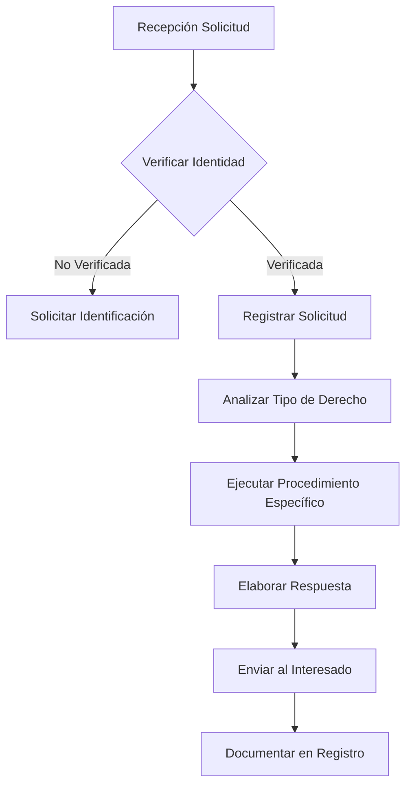
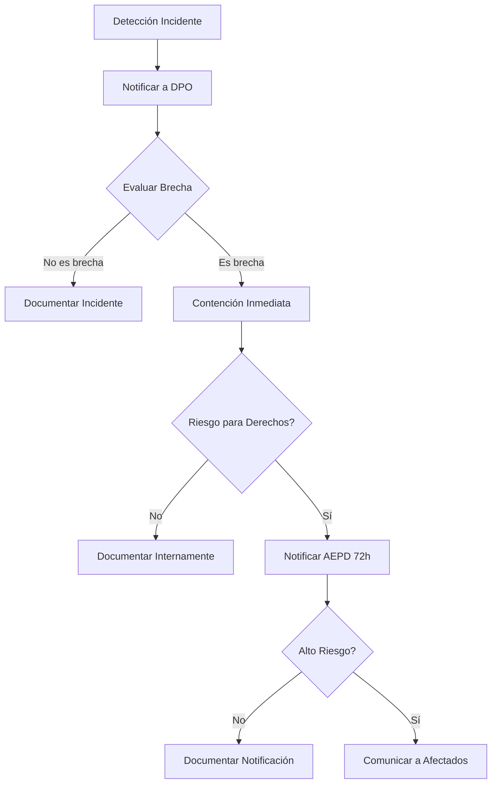
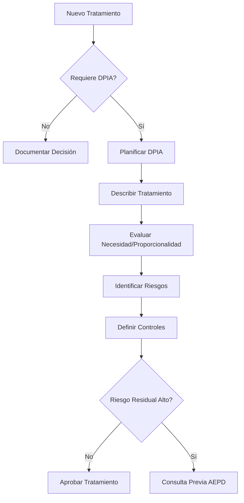
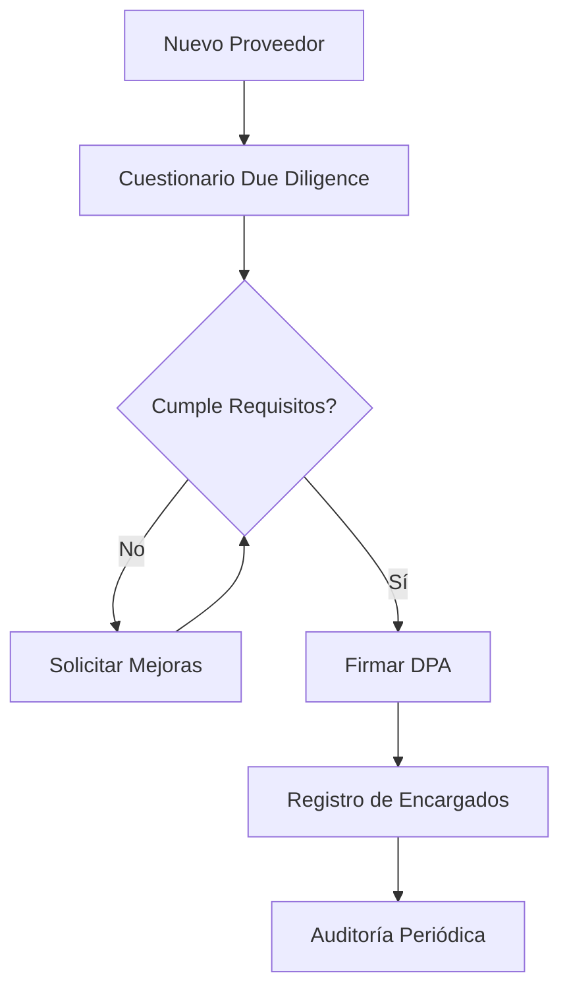

# DELEGADO DE PROTECCIÓN DE DATOS (DPO)

## Perfil, Responsabilidades y Marco de Actuación

**Documento:** GDPR-DPO-001  
**Versión:** 1.0  
**Fecha:** 4 de julio de 2025  
**Clasificación:** ORGANIZATIVO

---

## 1. INTRODUCCIÓN Y MARCO LEGAL

### 1.1 Fundamento Jurídico

El puesto de Delegado de Protección de Datos (DPO) está regulado por:

- **Artículos 37-39** del Reglamento General de Protección de Datos (RGPD)
- **Artículos 34-37** de la Ley Orgánica 3/2018 de Protección de Datos (LOPDGDD)
- **Directrices WP243** del Grupo de Trabajo del Artículo 29 (ahora CEPD)
- **Guía del DPO** de la Agencia Española de Protección de Datos (AEPD)

### 1.2 Necesidad del DPO en Kopp Stadium

La designación de un DPO es obligatoria para Kopp Stadium S.L. debido a:

✅ **Tratamiento a gran escala** de datos personales de clientes y usuarios
✅ **Monitorización sistemática** del comportamiento de usuarios en la plataforma CRM
✅ **Datos de categorías especiales** en determinados módulos del sistema
✅ **Tratamiento como actividad principal** del negocio

---

## 2. PERFIL DEL DPO

### 2.1 Cualificaciones Profesionales

El DPO de Kopp Stadium debe contar con:

#### 2.1.1 Formación Académica

- **Titulación superior** en Derecho, Informática o áreas afines
- **Certificación especializada** en protección de datos (IAPP, EIPA, etc.)
- **Formación continua** acreditada (mín. 60 horas anuales)

#### 2.1.2 Experiencia Profesional

- **Mínimo 5 años** en protección de datos o privacidad
- **Experiencia demostrable** en implementación de programas de cumplimiento RGPD
- **Conocimiento del sector** CRM, marketing y gestión de clientes

#### 2.1.3 Competencias Técnicas

- Conocimiento profundo de legislación de protección de datos (RGPD, LOPDGDD)
- Familiaridad con tecnologías de privacidad y seguridad de la información
- Comprensión de procesos de negocio y flujos de datos
- Capacidad para realizar evaluaciones de impacto (DPIA)

#### 2.1.4 Competencias Personales

- Integridad y ética profesional
- Capacidad de comunicación con diferentes niveles de la organización
- Habilidades de negociación y resolución de conflictos
- Independencia y autoridad moral

### 2.2 Posición en la Organización

#### 2.2.1 Ubicación Jerárquica

- **Reporte directo** al más alto nivel directivo (CEO)
- **Independencia funcional** garantizada por escrito
- **Participación obligatoria** en Comité de Dirección para temas de privacidad
- **Acceso directo** al Consejo de Administración cuando sea necesario

#### 2.2.2 Recursos Asignados

- **Equipo de soporte:** Mínimo 1 técnico especializado y 1 asesor legal
- **Presupuesto anual** para formación y herramientas
- **Tiempo protegido** para funciones de DPO (mínimo 60% jornada)
- **Acceso a consultoría externa** especializada

#### 2.2.3 Incompatibilidades

❌ **No puede desempeñar funciones que impliquen:**

- Determinar fines y medios del tratamiento
- Responsabilidad en departamentos de IT o Marketing
- Representación legal de la empresa en litigios de protección de datos
- Conflicto de intereses entre objetivos de negocio y protección de derechos

---

## 3. FUNCIONES Y RESPONSABILIDADES

### 3.1 Funciones Principales (Art. 39 RGPD)

#### 3.1.1 Información y Asesoramiento

- **Asesorar** al responsable, encargados y empleados sobre obligaciones RGPD
- **Formación** al personal involucrado en operaciones de tratamiento
- **Documentación** de consultas y asesoramiento prestado
- **Alertas regulatorias** sobre cambios normativos relevantes

#### 3.1.2 Supervisión del Cumplimiento

- **Verificar** implantación de políticas de protección de datos
- **Auditar** actividades de tratamiento periódicamente
- **Asignar responsabilidades** en materia de protección de datos
- **Monitorizar** el cumplimiento continuo del RGPD

#### 3.1.3 Evaluaciones de Impacto

- **Asesorar** sobre la necesidad de realizar DPIAs
- **Supervisar** la realización de evaluaciones de impacto
- **Revisar** la calidad y conclusiones de los DPIAs
- **Verificar** la implementación de medidas recomendadas

#### 3.1.4 Cooperación con Autoridades

- **Punto de contacto** con la AEPD y otras autoridades
- **Consultas previas** según Art. 36 RGPD
- **Gestión** de inspecciones y requerimientos
- **Reporte** de brechas de seguridad cuando proceda

### 3.2 Funciones Específicas en Kopp Stadium

#### 3.2.1 Gestión del Sistema CRM

- **Validar** configuración de privacidad del sistema
- **Revisar** procedimientos de ejercicio de derechos ARSOLP
- **Supervisar** accesos a datos personales
- **Asesorar** en integración con sistemas externos (HubSpot, Zapier, Slack)

#### 3.2.2 Marketing y Comunicaciones

- **Validar** bases legales para comunicaciones comerciales
- **Revisar** procesos de opt-in y preferencias
- **Supervisar** segmentaciones y perfilados
- **Asesorar** en campañas y acciones especiales

#### 3.2.3 Desarrollo de Nuevos Productos

- **Participar** en fase de diseño (Privacy by Design)
- **Evaluar** impacto en privacidad de nuevas funcionalidades
- **Recomendar** medidas técnicas y organizativas
- **Validar** cumplimiento antes del lanzamiento

#### 3.2.4 Gestión de Incidentes

- **Coordinar** respuesta a violaciones de datos
- **Evaluar** necesidad de notificación a AEPD
- **Asesorar** en comunicación a afectados
- **Documentar** incidentes y medidas correctivas

---

## 4. PROCEDIMIENTOS DE ACTUACIÓN

### 4.1 Metodología de Trabajo

#### 4.1.1 Ciclo Anual de Cumplimiento

```
Q1: Auditoría de cumplimiento general
Q2: Revisión de registros de actividades
Q3: Evaluación de riesgos y DPIAs
Q4: Planificación para el año siguiente
```

#### 4.1.2 Reuniones Periódicas

- **Comité de Privacidad:** Mensual (DPO + IT + Legal + Negocio)
- **Comité de Dirección:** Trimestral (presentación status)
- **Comité Técnico:** Quincenal (revisión de proyectos)
- **Consejo de Administración:** Semestral (informe ejecutivo)

#### 4.1.3 Sistema de Gestión Documental

- **Registro de actividades** actualizado trimestralmente
- **Informes de cumplimiento** con dashboard de KPIs
- **Registro de consultas** internas y externas
- **Biblioteca de políticas** y procedimientos

### 4.2 Procedimientos Específicos

#### 4.2.1 Ejercicio de Derechos



#### 4.2.2 Gestión de Brechas de Seguridad



#### 4.2.3 Evaluaciones de Impacto



#### 4.2.4 Verificación de Encargados



---

## 5. RESPONSABILIDAD Y RENDICIÓN DE CUENTAS

### 5.1 KPIs de Desempeño

| Indicador                 | Objetivo | Medición                     | Periodicidad |
| ------------------------- | -------- | ---------------------------- | ------------ |
| Cumplimiento normativo    | 100%     | Auditoría independiente      | Anual        |
| Tiempo respuesta derechos | <15 días | Tiempo medio resolución      | Mensual      |
| Formación de empleados    | >95%     | % plantilla formada          | Trimestral   |
| Incidentes gestionados    | 100%     | % documentados correctamente | Trimestral   |
| DPIAs completados         | 100%     | % proyectos evaluados        | Semestral    |
| Consultas atendidas       | >95%     | % consultas resueltas        | Mensual      |

### 5.2 Informes Periódicos

- **Informe ejecutivo:** Trimestral para Dirección
- **Dashboard de privacidad:** Actualización mensual
- **Memoria anual:** Documento completo de actividades
- **Informes ad-hoc:** Para temas específicos/urgentes

### 5.3 Protección del DPO

- **Independencia garantizada** documentalmente
- **Prohibición de instrucciones** sobre el ejercicio de funciones
- **Protección frente a represalias** por desempeño del cargo
- **Acceso directo** a la alta dirección
- **Recursos adecuados** para el desarrollo de funciones
- **Formación continua** garantizada

---

## 6. ANEXOS Y DOCUMENTACIÓN

### 6.1 Documentos de Referencia

- **Nombramiento formal** del DPO
- **Comunicación a AEPD** del nombramiento
- **Comunicación interna** a empleados
- **Descripción de puesto** detallada
- **Procedimientos operativos** específicos
- **Informes anuales** anteriores

### 6.2 Canales de Contacto

- **Email DPO:** <dpo@kopp-stadium.com>
- **Formulario web:** <www.kopp-stadium.com/dpo>
- **Teléfono directo:** +34 900 123 456
- **Dirección postal:** A/A DPO, Calle Ejemplo 123, 28001 Madrid
- **Canal interno:** <dpo.interno@kopp-stadium.com>

---

**Documento organizativo**  
**Próxima revisión:** 4 de julio de 2026  
**Versión:** 1.0  
**ID:** GDPR-DPO-001

---

### CONTROL DE CAMBIOS

| Versión | Fecha      | Cambios         | Autor                     |
| ------- | ---------- | --------------- | ------------------------- |
| 1.0     | 04/07/2025 | Versión inicial | Dirección General + Legal |
